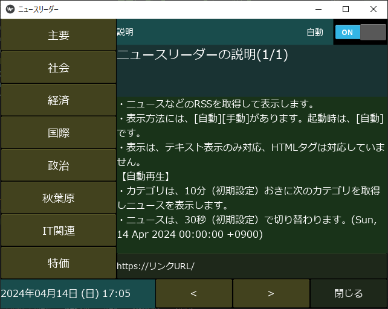

# kv-newsreader
GUIにKivyを利用して、ニュースリーダーを作成 
タイミングの異なるインターバルを3つ使ってみました。

* 8個のURLをカテゴリとして登録できます
* 起動すると、一番上のカテゴリのニュースを取得して表示します。
* 右上のスイッチボタンで、自動再生と手動再生を切り替えることができます。
* 自動再生はニュースは30秒ごとに自動で切り替わり、終わりまで表示するとまた最初から
表示します。カテゴリについても10分毎に次のカテゴリに切り替わります。
